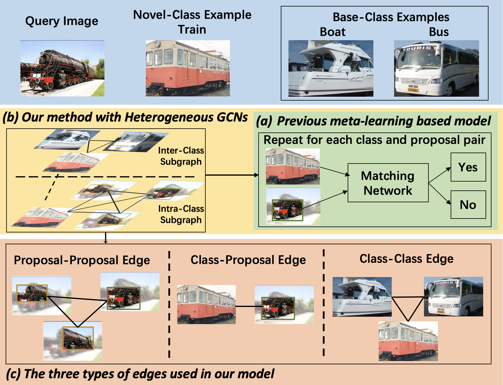

# QA-FewDet

This repo contains the official PyTorch implementation for the ICCV 2021 paper: 'Query Adaptive Few-Shot Object Detection with Heterogeneous Graph Convolutional Networks' ([paper](https://arxiv.org/abs/2112.09791)).

<div align="center"></div>

## Highlights

- We propose a novel graph based model that considers class-class, class-proposal, and proposal-proposal relations for few-shot object detection.
- Our meta-learning based models achieve strong few-shot object detection performance without fine-tuning.

## Installation

Our codebase is built upon [detectron2](https://github.com/facebookresearch/detectron2). You only need to install [detectron2](https://github.com/facebookresearch/detectron2/blob/main/INSTALL.md) following their instructions.

Please note that we used detectron 0.2.1 in this project. Higher versions of detectron might report errors.

## Data Preparation

- We evaluate our model on two FSOD benchmarks PASCAL VOC and MSCOCO following the previous work [TFA](https://github.com/ucbdrive/few-shot-object-detection).
- Please prepare the original PASCAL VOC and MSCOCO datasets and also the few-shot datasets following [TFA](https://github.com/ucbdrive/few-shot-object-detection/blob/master/datasets/README.md) in the folder ./datasets/coco and ./datasets/pascal_voc respectively.
- Please run the scripts in ./datasets/coco and ./datasets/pascal_voc step by step to generate the support images for both many-shot base classes (used during meta-training) and few-shot classes (used during few-shot fine-tuning).

## Model training and evaluation on MSCOCO

- We have two training stages, first meta-training and then few-shot fine-tuning.
- During meta-training, we have two training steps. First, we train the baseline model following [FewX](https://github.com/fanq15/FewX). Then we add the
proposed heterogeneous GCNs and train the whole model. The training script is
```
sh scripts/meta_training_coco_resnet101.sh
```
after meta-training, the model are directly evaluated on novel classes without fine-tuning.

- We perform 1/2/3/5/10/30-shot fine-tuning after the two-step meta-training, using the exact same few-shot datasets as [TFA](https://github.com/ucbdrive/few-shot-object-detection). The training script is
```
sh scripts/few_shot_finetune_coco_resnet101.sh
```

## Model training and evaluation on PASCAL VOC

- We evaluate our model on the three splits as [TFA](https://github.com/ucbdrive/few-shot-object-detection).
- Similar as MSCOCO, we have two training stages, and two training steps during meta-training. 
- The training scripts for VOC split1 is 
```
sh scripts/meta_training_pascalvoc_split1_resnet101.sh
sh scripts/few_shot_finetune_pascalvoc_split1_resnet101.sh
```
- The training scripts for VOC split2 is 
```
sh scripts/meta_training_pascalvoc_split2_resnet101.sh
sh scripts/few_shot_finetune_pascalvoc_split2_resnet101.sh
```
- The training scripts for VOC split3 is 
```
sh scripts/meta_training_pascalvoc_split3_resnet101.sh
sh scripts/few_shot_finetune_pascalvoc_split3_resnet101.sh
```

## Model Zoo 

We provided the meta-trained models over base classes for both MSCOCO dataset and the 3 splits on VOC dataset. The model links are [Google Drive](https://drive.google.com/drive/u/0/folders/1Opydf55rA28XKXEk_aoTKK_usjHXWepC) and [Tencent Weiyun](https://share.weiyun.com/STzahXxB).

## Citing QA-FewDet
If you use this work in your research or wish to refer to the baseline results published here, please use the following BibTeX entries:
```
@inproceedings{han2021query,
  title={Query adaptive few-shot object detection with heterogeneous graph convolutional networks},
  author={Han, Guangxing and He, Yicheng and Huang, Shiyuan and Ma, Jiawei and Chang, Shih-Fu},
  booktitle={Proceedings of the IEEE/CVF International Conference on Computer Vision},
  pages={3263--3272},
  year={2021}
}
@inproceedings{han2022meta,
  title={Meta faster r-cnn: Towards accurate few-shot object detection with attentive feature alignment},
  author={Han, Guangxing and Huang, Shiyuan and Ma, Jiawei and He, Yicheng and Chang, Shih-Fu},
  booktitle={Proceedings of the AAAI Conference on Artificial Intelligence},
  volume={36},
  number={1},
  pages={780--789},
  year={2022}
}
@inproceedings{fan2020few,
  title={Few-shot object detection with attention-RPN and multi-relation detector},
  author={Fan, Qi and Zhuo, Wei and Tang, Chi-Keung and Tai, Yu-Wing},
  booktitle={Proceedings of the IEEE/CVF Conference on Computer Vision and Pattern Recognition},
  pages={4013--4022},
  year={2020}
}
@inproceedings{wang2020frustratingly,
  title={Frustratingly simple few-shot object detection},
  author={Wang, Xin and Huang, Thomas E and Darrell, Trevor and Gonzalez, Joseph E and Yu, Fisher},
  booktitle={Proceedings of the 37th International Conference on Machine Learning},
  pages={9919--9928},
  year={2020}
}
```

## Acknowledgement

This repo is developed based on [Meta Faster R-CNN](https://github.com/GuangxingHan/Meta-Faster-R-CNN), [FewX](https://github.com/fanq15/FewX), [TFA](https://github.com/ucbdrive/few-shot-object-detection) and [detectron2](https://github.com/facebookresearch/detectron2). Thanks for their wonderful codebases.

